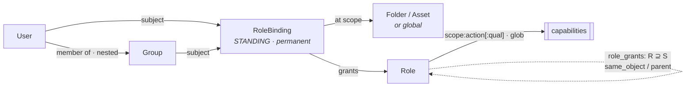
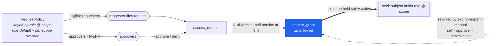

# Access & approval model

This is the conceptual reference behind the `Authorizer` and the approval `Resolver`.
It describes how groups, folders, assets, roles, bindings, and request policies
interact to decide who can do what, where, and how they get there.

> The whole model described here is live: nested groups, the explicit
> ReBAC-light role-rewrite engine (`same_object` and `parent` rewrite rules, resolved
> by `HoldsRole`), the standing-only RoleBinding, the RequestPolicy-driven Requestable
> visibility tier, and activation — the `RequestAccess → N-of-M approval → time-boxed
> access_grant → reaper` workflow. Revocation is enforced end to end: a revoked or
> expired grant (or a removed standing binding, membership, or capability) stops
> conferring access and tears down any live session that depended on it. See
> [continuous revocation](architecture.md#continuous-revocation--live-session-teardown).

## Entities

| Entity | What it is |
|---|---|
| User | A local account (email, argon2id password, `deactivated_at`). There is no admin flag: administrative power comes solely from holding capabilities (the bootstrap admin holds `**` via a global role binding). |
| Group | A named set of subjects. A group's members are users and/or other groups, which is what makes groups nested. |
| Folder | A container in a hierarchy (`parent_id`). Organizes assets and is the unit of folder-scoped inheritance. |
| Asset | A protected resource (an SSH host, a Postgres DB, a Kubernetes cluster, an RDP host). Belongs to exactly one folder; carries free-form `labels`. |
| Capability | A scoped, namespaced verb — a colon-delimited path `scope:action[:qualifier…]` (`ssh:connect`, `ssh:login:root`, `db:login:app`, `k8s:group:developers`). Format-validated at role creation and matched with glob semantics (`*` is one segment, trailing `**` is a whole scope). warden treats a data-plane capability as an opaque token; its meaning is enforced at the worker, with one already load-bearing in the control plane: `ssh:login:<account>` drives the [SSH cert principals](#ssh-access--os-logins-are-capabilities) the broker mints. Management capabilities are enforced by warden itself. See [capabilities.md](capabilities.md). |
| Role | An admin-defined named bundle of capabilities. A role is global or homed in a folder (`folder_id`); the home governs who may administer the role and makes it DNS-addressable as `<role>.<folder-path>`, and does not restrict what the role's capabilities mean. For example, *pg-app* = `[db:login:app]`, *cluster-dev* = `[k8s:group:developers]`. |
| RoleBinding | Attaches a role to a subject (user or group) at a scope — a folder, an asset, or global (scopeless, conferring the role everywhere). A binding is standing-only: permanent, admin-granted access. There is no `requestable` kind; requestability comes from a RequestPolicy. |
| RequestPolicy | One row per (role R, scope = folder \| asset \| NULL-default). Its existence makes R requestable on that scope. It carries the requester side (who may ask), the approval threshold, and the approver side (who signs off). It replaces the old ApprovalRule and the `requestable` binding in one model. |

Relationship rows (`group_memberships`, `folders.parent_id`, `role_bindings`,
`role_grants`, `request_policies` plus `request_policy_subjects`) are stored
tuple-shaped, so the whole model could be mirrored into an external engine (OpenFGA)
later without changing the domain.

## The two inheritance axes

Everything below flows from two kinds of inheritance, and both the standing (Active)
and the requestable axes resolve folder inheritance through the same explicit
role-rewrite engine:

1. Nested-group membership (transitive). If `alice ∈ sre` and `sre ∈ platform`, then
   `alice` is a member of `platform`, and any binding to `platform` applies to `alice`.
2. Folder inheritance (down the resource tree), explicit. A role cascades from a
   folder to its descendants (child folders and assets directly in the folder) only
   if the role declares a `parent` role-rewrite rule (canonically `R ⊇ R via parent`).
   There is no automatic subtree inheritance: a folder binding with no `parent` rule
   confers the role on the folder object alone. This is governed by the role-rewrite
   graph (see [Role inheritance](#role-inheritance)) and is the same `HoldsRole` walk
   used for standing access, for a RequestPolicy's requester and approver held-role
   predicates, and for the most-specific policy resolution (which walks a policy up
   the folder ancestors).

Nested-group membership and the folder walks are resolved with recursive SQL (CTEs)
in `internal/authz` (`heldCTE` / `HoldsRole`, the requestable CTEs) and
`internal/approvals` (`EffectiveRule` / `IsApprover`).

## Standing access — "what can I do right now?"

A user has a capability on an asset when they hold — per the explicit role-rewrite
resolution (`HoldsRole`) — a role that includes that capability on that asset, backed
by a standing RoleBinding whose subject is the user (or a group they are transitively
in). That binding is either on the asset itself, or on an ancestor folder for a role
that declares a `parent` cascade rule (`R ⊇ R via parent`). A folder binding for a
role with no such rule confers access on the folder object alone, not its descendants.

Standing bindings are one source of the Active tier. The Active set is the held
closure over `role_bindings ∪ active access_grants` (non-expired, non-revoked JIT
grants): a granted role flows through the rewrite graph exactly like a permanent
binding, and stops conferring the instant it expires or is revoked (the closure
filters `revoked_at IS NULL AND expires_at > now()`). Governance is the exception. A
role obtained via a JIT grant confers access but not governance: it does not make you
an eligible requester or an approver. Those predicates resolve through a standing-only
closure (`HoldsRoleStanding`), so a granted `requester_role` or `approver_role` never
lets you request or approve further (see
[the grants-are-not-governance nuance](#approval--who-signs-off-and-how-a-request-activates)).

Worked example:

```
Groups:   alice ∈ sre ∈ platform
Folders:  prod ⊃ prod/db
Asset:    pg-prod  (in prod/db)
Role:     operator = [db:login:app, db:read]
Rewrite:  operator ⊇ operator  via parent      ← makes operator cascade down folders
Binding:  platform → operator   (standing)   on folder prod
```

`alice` can act as `operator` on `pg-prod`:

- `platform` reaches `alice` via nested membership (sre → platform),
- the `prod` binding reaches `pg-prod` because `operator` declares
  `operator ⊇ operator via parent`: holding `operator` on `prod` confers `operator`
  on `prod/db`, and on `pg-prod` in it (`HoldsRole` walks the `parent` rewrite from
  folder to descendants),
- `operator`'s capabilities include those actions.

Without the `operator ⊇ operator via parent` rule, the binding would confer `operator`
on the folder object `prod` only, not on `prod/db` or `pg-prod`. The folder cascade of
standing access is explicit; the rewrite rule does the work. With the rule in place,
adding a new asset under `prod`, or a new engineer to `sre`, needs no new bindings —
the graph does the work.

## Requestable eligibility & visibility tiers — "what can I see or ask for?"

A RequestPolicy does not grant access. It makes a role requestable on a scope and says
who may request it. Discoverability is itself permission-gated. Against any asset a
user is in exactly one tier:

| Tier | Meaning | Comes from |
|---|---|---|
| Active | Can act now | the user holds at least one role on the asset via the held set (`HoldsRole` / `heldCTE`, base = `role_bindings ∪ active access_grants`) |
| Requestable | Visible, may request | the user is eligible to request at least one role via an effective RequestPolicy, minus any role already held Active |
| Invisible | Existence not disclosed | neither, so `NotFound` |

A role R is requestable on asset A for user U when:

1. an effective `request_policy(R, A)` resolves, most-specific by scope: asset A
   override, then nearest ancestor folder, then role-level default (scope NULL); and
2. U is eligible for that policy — the policy names a `requester_role` U holds on A
   via a standing binding (`HoldsRoleStanding`, group-aware, `parent`-cascade-aware;
   a JIT grant of the requester_role does not count), or U (directly or via a nested
   group) is a `kind='requester'` explicit subject of the policy; and
3. U does not already hold R Active on A (Active excludes Requestable).

> A NULL requester is not "anyone". A policy with no `requester_role_id` and no
> `kind='requester'` subjects makes nobody eligible. Eligibility is a positive
> predicate, never default-open.

The catalog (`ListAssets` / `ListFolders`) returns Active ∪ Requestable nodes only,
plus nodes the caller manages. A direct lookup of an Invisible asset returns
`NotFound`, never `PermissionDenied`, so topology never leaks. `GetAssetAccess`
reports the caller's `active_roles`, `requestable_roles`, and held `capabilities` on
one asset (or `NotFound` if invisible); `GetFolderAccess` returns the caller's
management `capabilities` on a folder. All of this is set-based over the rewrite
graph; there are no requestable bindings anywhere.

### Worked examples

All three share:

```
Folders:  prod ⊃ prod/db
Asset:    pg-staging  (in prod/db)
Roles:    viewer = [db:read]
          dba    = [db:login:app, db:read, db:ddl]
Rewrite:  viewer ⊇ viewer via parent   ← viewer cascades down folders
```

1. Requester-role — holding it makes you Active and lets you request more.

```
Groups:   alice ∈ sre
Binding:  sre → viewer   (standing)   on folder prod
Policy:   request_policy(role=dba, scope=asset pg-staging,
                         requester_role=viewer, required_approvals=1)
```

`alice` on `pg-staging`:

- Active = `{viewer}`. She holds `viewer` via `sre`, and `viewer ⊇ viewer via parent`
  cascades it `prod → prod/db → pg-staging`.
- Requestable = `{dba}`. The effective policy for `dba` on `pg-staging` names `viewer`
  as its `requester_role`, which she holds on the asset, so she is eligible; `dba` is
  not yet held, so it stays Requestable.

A user not holding `viewer` (and not a requester subject) sees `pg-staging` as
Invisible (`NotFound`).

2. Explicit requester subject — Requestable-only, no standing access.

```
Groups:   carol ∈ contractors
Policy:   request_policy(role=dba, scope=asset pg-staging, required_approvals=1)
            request_policy_subject(kind=requester, subject=group:contractors)
```

`carol` on `pg-staging`:

- Active = `{}`. She holds no role via any standing binding.
- Requestable = `{dba}`. She (via `contractors`) is a `kind='requester'` subject of
  the policy, so she is eligible without any prerequisite role.

This is the deliberate lever to give a group the ability to ask without standing
access: the asset is discoverable and requestable, but `Active == false` until a
request is approved.

3. Self-service (`required_approvals = 0`).

`required_approvals = 0` is the self-service knob: a policy where an eligible
requester is auto-granted on `RequestAccess` (still fully audited), no approver
needed. The schema CHECK is `≥ 0` and the `CreateRequestPolicy` / `UpdateRequestPolicy`
validation is `gte: 0`. On a self-service request warden mints the `access_grant`
immediately in the same transaction and marks the request `granted`.

## Approval — who signs off, and how a request activates

The RequestPolicy that makes a role requestable also carries its approval gate, keyed
by (role, scope) and resolved most-specific (see above). The policy's primary home is
the role-level default (scope NULL), set when an admin creates the custom role. A
powerful role (for example `cluster-admin`) is therefore reachable only through
approval wherever it is requestable, and a role with no policy anywhere is not
requestable at all (it can only be handed out as a standing binding). A per-scope
override replaces the inherited policy for that (role, scope).

The approver side is symmetric with the requester side:

- `required_approvals` — the N-of-M threshold (`≥ 0`; `0` is self-service, see above).
  Distinct approvers are required; a requester cannot approve their own request, and a
  single deny rejects it.
- an optional approver-role — whoever holds this role on the requested asset via a
  standing binding may approve, resolved via `HoldsRoleStanding` (direct binding on
  the asset, or an ancestor-folder binding for a role with a `parent` cascade rule),
  group-aware. A JIT grant of the approver_role does not make you an approver.
- optional explicit approver subjects (`kind='approver'`, users or groups).
- Approvers are approver-role holders (standing) ∪ explicit approver subjects.

(`Resolver.IsApprover` and `IsEligibleRequester` implement these two symmetric
predicates over the effective policy; both resolve their role branch through
`HoldsRoleStanding`, so JIT grants confer access but never governance.)

### Resolution (most-specific wins)

To act on role R at asset A, the effective policy is the most specific of:

```
(R, asset A)                      ← override on the asset itself      (wins)
(R, nearest ancestor folder of A) ← override on a folder up the tree
   … farther ancestor folders …
(R, role-level default, scope NULL)← the policy set at role definition (fallback)
none  ⇒  NOT requestable
```

Because roles cascade down folders via `parent` rewrites, requesting R at a folder
(broad) and R at an asset (narrow) start the walk at different scopes, so they can be
two different approval flows. Getting broad `admin@folder` is deliberately a different
(usually heavier) approval than narrow `admin@asset`.

### Worked example

```
Role:     cluster-admin = [k8s:group:system:masters]
          role-level default policy: required_approvals=1, approver_role=owner
Rewrite:  owner ⊇ owner via parent      ← owner cascades down folders
Folder:   k8s ; Asset: cluster-x (in k8s)
Policy subject (requester): request_policy(cluster-admin, default) + subject group:eng
Binding:  dana → owner   (standing)   on folder k8s     (dana is an owner)
```

`alice ∈ eng` requests, dana approves — the full flow on `cluster-x`:

1. `RequestAccess(cluster-admin, cluster-x, 4h, "incident #42")`. alice is eligible:
   the role-default policy names `group:eng` as a `kind='requester'` subject, and she
   is in `eng`, so `cluster-x` is Requestable and `Active == false`. warden opens an
   `access_requests` row, snapshotting `required_approvals=1` and
   `granted_duration = min(4h, policy.max_duration, MaxGrantTTL)`, status `pending`,
   and audits `access_request.created`. (A second pending request for the same
   `(alice, cluster-admin, cluster-x)` is refused with `AlreadyExists`; if she already
   held it Active it would be `FailedPrecondition`.)
2. `ApproveRequest`. Approvers are standing holders of `owner` on `cluster-x` ∪
   explicit. `owner` cascades `k8s → cluster-x` via `owner ⊇ owner via parent`, so
   dana's folder binding makes her an approver, and dana approves (she may not be the
   requester, and can vote only once — `UNIQUE(request_id, approver)`). This is the
   first of one required approval, so warden mints the grant atomically under a row
   lock.
3. The grant. A time-boxed `access_grants` row for `cluster-admin` is written for
   alice on `cluster-x` with `expires_at = now() + granted_duration`; the request flips
   to `granted`. It joins her held closure, so she is now Active on `cluster-x`. warden
   audits `access_request.approved` and `access_grant.activated`. It confers no
   governance: if `cluster-admin` were itself a `requester_role` or `approver_role`
   somewhere, this grant would not let alice request or approve further, since those
   resolve standing-only.
4. It ends. The grant stops conferring the instant it expires (`expires_at`) or is
   revoked. The reaper (a 30-second background sweep) marks expired grants
   `revoked_reason='expired'`, audits `access_grant.expired`, and triggers teardown.
   alice reverts to Requestable. Because authorization is continuous,
   expiry/revocation also tears down any live session the grant supported — see
   [continuous revocation](architecture.md#continuous-revocation--live-session-teardown).

Self-service variant: had the policy set `required_approvals=0`, step 1 would mint the
grant immediately (no approver), and alice would become Active on the spot.

Duration clamp: the effective grant lifetime is
`min(requested, policy.max_duration, global MaxGrantTTL=8h)`, snapshotted at request
time so a later policy edit cannot retroactively change an in-flight request.

Revocation authority. A live grant may be revoked by an admin, the grant's own subject
(self-revoke, to drop elevated access when the task is done), or any standing approver
for its `(role, asset)` (symmetric with approval authority). It is also revoked
automatically when the subject is deactivated. Every revoke and expiry audits
`access_grant.revoked` or `.expired` and calls the teardown seam. See the
[revocation matrix](security.md#continuous-enforcement--revocation-tears-down-live-sessions).

Now tighten a vital asset with an override:

```
Policy override: request_policy(cluster-admin, asset cluster-prod)
                 required_approvals=2, no approver_role,
                 request_policy_subject(kind=approver, subject=group:sec-leads)
```

A request for `cluster-admin` on `cluster-prod` now needs two approvals from
sec-leads only; folder owners no longer qualify there. The override replaces the
inherited policy for that (role, scope).

## SSH access — OS logins are capabilities

The same capability graph that decides whether a user reaches an SSH host also decides
which OS accounts they may log in as — the Teleport-style model. An OS login is a
capability `ssh:login:<account>` (it fits the `scope:action:qualifier` grammar; see
[capabilities.md](capabilities.md)); a role grants it like any other capability
(`ssh-admin = [ssh:login:root]`, `ssh-deploy = [ssh:login:deploy]`, or the broad
`ssh:login:*`).

An SSH asset configures a set of logins (`ssh_asset_login` rows), each with an auth
`kind` (`ca` / `password` / `key`). When the
[CredentialBroker](architecture.md#vault--credentialbroker) issues a credential for a
`ca`-kind login, it signs a certificate whose `ValidPrincipals` are the host-scoped
forms of exactly the logins the user is entitled to:

```
{ <login>@<asset> : login ∈ the asset's ssh_asset_login rows
                  ∧ the user holds ssh:login:<login> on the asset }
```

That is the asset's configured logins intersected with the user's held `ssh:login:*`
capabilities (resolved by the same glob-aware, group-aware `Check`). The broker
enforces the same `ssh:login:<login>` capability for the `password` and `key` kinds
too, before returning the stored secret, so authorization is uniform across kinds. The
login capability may be held via a standing binding or an active JIT grant — grants
count in `Check` exactly like standing access — so requesting a role like `ssh-admin`
just-in-time is what lets a user `root` into a box for the grant's window. For an asset
whose logins are `root` and `deploy`:

- A user holding `ssh:login:root` gets a credential for `root` only.
- A user holding `ssh:login:*` gets both `root` and `deploy`.
- A user holding no matching login capability gets nothing. The broker refuses (no
  cert, no audit), and the SSH CA independently refuses to sign a principal-less
  certificate as defense-in-depth.

So there is no static host login: the account a user lands as is a strict function of
their live entitlements, bounded by the logins the asset actually offers. The
`ssh:connect` session and the login gate are enforced live at the ssh-proxy worker.

RDP reuses this exact mechanism: `rdp:login:<login>` gates a target account on an
RDP asset (`rdp_asset_login` rows, password-only) the same way `ssh:login:<login>`
gates an OS account, intersected the same way and enforced live at the rdp-proxy
worker.

Postgres and Kubernetes follow the same idea with their own vocabularies:
`db:login:<role>` gates a Postgres role and drives the minted credential, and
`k8s:group:<name>` is projected into Kubernetes impersonation. Kubernetes differs in
one important way — wildcards grant no groups — covered in
[capabilities.md](capabilities.md#kubernetes-holding-a-group-is-the-gate-and--is-not-cluster-admin).

## Onboarding & the empty-catalog consequence

Because requestability is a positive predicate (a held role or a named subject), a
brand-new user with zero roles and in no requester subject list sees nothing. This is
intended least-privilege behavior, not a bug. Onboarding therefore means one of:

- grant a baseline standing role (which may itself be a `requester_role` on policies,
  making the user both Active on some assets and eligible to request more), or
- list the user's group in a policy's `kind='requester'` subjects.

Future: SSO group mapping (OIDC/SAML plus SCIM, a roadmap sub-project) would let users
gain roles via synced group membership, removing the manual first-grant step.

## Role inheritance

Role inheritance is an explicit ReBAC-light role-rewrite model. Role composition and
folder cascade are expressed as data — declared rewrite rules — not implicit behavior.
It is ReBAC-light because the object types are fixed (user, group, folder, asset) and
only roles and their rewrite rules are user-definable; it has none of OpenFGA's
arbitrary-type generality.

### The rewrite rules — `role_grants`

A rewrite rule lives in `role_grants(role_id R, source_role_id S, via)` and means
"holding `S` on the relevant object confers `R`". There are two `via` kinds:

| `via` | Meaning | Use |
|---|---|---|
| `same_object` | Holding `S` on object `O` confers `R` on the same `O`. | Role composition — one role including another's capabilities on the same object. |
| `parent` | Holding `S` on a folder confers `R` on that folder's children (child folders and assets directly in it). | Folder cascade — the (now explicit) "grant on a folder flows down the tree" behavior. |

Role composition is expressed via `same_object` rules (not a `parent_role_id`
capability union): `editor ⊇ owner via same_object` means anyone holding `owner` on an
object also holds `editor` there.

### Resolution — `HoldsRole`

`RoleResolver.HoldsRole(user, role, objectKind, objectID)` answers "does this user
hold this role on this object?" by goal expansion. It starts from the goal
`(role, object)` and rewrites it backwards through `role_grants` (`same_object` to the
same object, `parent` to the parent folder) until it reaches a goal satisfied by a
direct standing binding for the user or a group they are transitively in. It is:

- transitive — chains of rules compose (`owner → editor → cluster_editor`);
- group-aware — a standing binding to a nested group satisfies the goal;
- cycle-safe — goals are deduped via `UNION`, so the finite goal set terminates (no
  silently-truncating depth limit).

An explicit-only property follows: a role cascades down folders if and only if it
declares a `parent` self-rule (`R ⊇ R via parent`); no rule means no cascade. The same
`HoldsRole` predicate backs standing access and the requester and approver held-role
checks on a RequestPolicy.

### Worked example

```
Roles:    owner, editor, cluster_editor, admin
Rewrite:  editor         ⊇ owner   via same_object
          editor         ⊇ editor  via parent
          cluster_editor ⊇ admin   via same_object
          cluster_editor ⊇ editor  via parent
Folders:  prod ⊃ prod/db
Asset:    pg  (in prod/db)
Groups:   alice ∈ sre
Binding:  sre → owner   (standing)   on folder prod
```

From the single `sre → owner` standing binding on `prod`, alice holds:

- `owner @ prod` — direct standing binding (via her group `sre`);
- `editor @ prod` — `editor ⊇ owner via same_object` on the same object;
- `editor @ prod/db` — `editor ⊇ editor via parent` cascades `editor` down;
- `cluster_editor @ pg` — `cluster_editor ⊇ editor via parent` reaches the asset `pg`
  from the `editor` she holds on its folder `prod/db`.

bob (in no group with a binding) holds none of these. And there is no path to
`admin @ pg`: nothing confers `admin` on `pg`.

### Introspection & administration

- `ExplainRole(user, role, asset) → {holds, paths}` answers "why do I hold this
  role?" Each `path` is the ordered rewrite chain from the requested `(role, asset)`
  down to the satisfying standing binding, with the subject (`user:…` / `group:…`).
  `holds` is `len(paths) > 0`.
- Admins manage the rules with `AddRoleGrant`, `RemoveRoleGrant`, and `ListRoleGrants`
  (in `AccessService`).

Each role still carries its own RequestPolicy default, so a composed role like
`cluster_editor` can require heavier approval than the roles it is built from.

## How the pieces fit

The model has two halves. Standing structure is the durable vocabulary: who holds
which role, where. Just-in-time is the runtime pipeline that grants a role
temporarily. Both land a subject in the same held set (`subject holds role @ scope`),
from which the Authorizer resolves capabilities.

### Standing structure — who holds what, where



### Just-in-time — requestable → granted

A `RequestPolicy` keyed by `(role, scope)` is what makes that pairing requestable; it
names the eligible requesters and the N-of-M approvers. A granted request mints a
time-boxed `access_grant` that joins the held set until it expires or is revoked.



- Access (held): the Authorizer resolves the explicit role-rewrite graph (`HoldsRole`,
  or its forward-closure dual `heldCTE`) over nested groups plus `role_grants`
  (`same_object` / `parent`) down to a base of `role_bindings ∪ active access_grants`,
  yielding capabilities.
- Discovery (tiers): Active from the held closure; Requestable from RequestPolicy
  eligibility (effective policy plus a standing `requester_role`/subject predicate,
  minus already-Active); else Invisible (`NotFound`).
- Activation (Requestable → grant): `RequestAccess` opens a request;
  `IsApprover` / `IsEligibleRequester` (standing-only) gate approve and request; the
  N-th distinct approval (or a self-service N=0) mints a time-boxed `access_grants`
  row that joins the held set until it expires or is revoked. A reaper reaps at expiry.
- Grants are not governance: a JIT-granted role confers access but is excluded from
  the requester and approver predicates (`HoldsRoleStanding`), so it can never be used
  to request or approve further access.
- Audit: every request, approval, grant, revoke, and expiry is appended to the
  hash-chained log (see [architecture](architecture.md#audit--recording)).

## Related

- [architecture.md](architecture.md#access-model) — where this sits in the system.
- [data-model.md](data-model.md) — the tables (`role_bindings`, `request_policies`,
  `request_policy_subjects`) that encode this model.
- [decisions.md](decisions.md) — why ReBAC-over-SQL, custom Role plus RoleBinding, the
  request-policy model, and the service layout.
