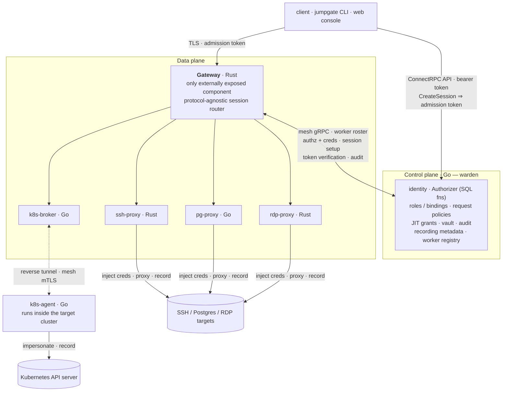

# Architecture

jumpgate grants secure, audited, just-in-time access to infrastructure. The core
bet is zero standing credentials: nothing is granted until it is requested, and
access is time-boxed, approval-gated, credential-injected, and fully recorded. When
the authorization behind a live session is revoked, the session is torn down, not
merely blocked at the next connect.

jumpgate proxies four protocols today. SSH, Postgres, and RDP run through an
agentless network proxy, so a target needs nothing installed. Kubernetes uses a
lightweight agent that runs inside the target cluster and dials out, so no inbound
port is opened on the cluster. Further databases are additive workers, called out
as planned where they appear.

## The three planes



The control plane brokers; the data plane enforces. Security-critical state (vault,
policy, grants) stays centralized in Go. A worker holds a credential only for the
duration of one live, authorized session.

## Control plane — Go

warden is the single source of truth. It serves a ConnectRPC API (Connect, gRPC,
and gRPC-Web on one handler, no proxy) alongside `/healthz`. An interceptor
authenticates every call, accepting either an `Authorization: Bearer <token>`
header (CLI) or an `httpOnly` `jumpgate_session` cookie with `Sec-Fetch-Site:
same-origin` as a fail-closed CSRF gate (browser). Requests are validated by
protovalidate, and non-visible resources return `CodeNotFound` to hide existence. A
second, mutually-authenticated listener serves the internal mesh for the data plane
and gateway.

### Services

The API is split into focused ConnectRPC services.

| Service | Responsibility |
|---|---|
| `AuthService` | password login → opaque bearer token (CLI) or `httpOnly` session cookie (browser); `WhoAmI` (identity plus global capabilities for nav gating); `Logout` |
| `IdentityService` | users, groups, nested memberships, user lifecycle; path-scoped `ListGroups` and `GetGroupAccess` |
| `CatalogService` | folders and assets (SSH, Postgres, Kubernetes, and RDP typed config): create, rename/move, delete; path-scoped `ListFolders`/`ListAssets`; `GetAssetAccess`/`GetFolderAccess`; `ListFolderContents`; `SearchCatalog`; `Resolve*` |
| `AccessService` | roles, role-grants, standing role-bindings, request policies and subjects, `ExplainRole`; path-scoped `ListRoles`, `GetRoleAccess` |
| `AccessRequestService` | the JIT runtime: request, approve, deny, cancel, revoke, grants, approval resolution |
| `VaultService` | CA init and public material, mesh CA and cert issuance, session-signing-key init, asset secrets (metadata only on read) |
| `EnrollmentService` | mint a single-use Kubernetes agent enrollment token; sign an agent's CSR into a mesh cert (`SignAgentCert`) |
| `RecordingService` | list, get, and presigned-download of session recordings (SSH, Postgres, Kubernetes, RDP) |
| `SessionService` | `CreateSession` (SSH), `CreatePostgresSession`, `CreateKubernetesSession`, `CreateWebSession`, `CreateRDPSession` — each mints a data-plane admission token for an authorized (user, asset) |
| `GatewayService` | `WatchWorkers` roster stream and `GetSessionVerificationKey` for the gateway |
| `Dataplane` (mesh) | worker registration/heartbeat stream and `SetupSession` |
| `HealthService` | liveness |

### Authorization is capability-only

There is no admin flag. Every management RPC is gated by a capability check at the
relevant scope (`requireCap`). The bootstrap admin is an ordinary user holding an
`admin` role whose single capability is `**`, bound globally. See
[capabilities.md](capabilities.md) and [access-model.md](access-model.md).

### Persistence

Postgres via sqlc and pgx, with goose migrations embedded in the binary and applied
on startup. The authorization semantics live in the database as a set of inlinable
PostgreSQL SQL functions: `authz_held` and `authz_held_standing` (the forward held
closure, with and without JIT grants), `authz_global_held` (scopeless roles),
`authz_user_groups` (the nested-group closure), `authz_role_goals` and
`authz_role_goal_paths` (backward goal expansion for `HoldsRole` and `ExplainRole`),
and `authz_effective_request_policy` (most-specific policy selection), over the
`active_access_grants` view (the single "grant is live" predicate). The Go
`Authorizer` reaches them through static, typed sqlc queries, so the
recursive-closure logic has one source of truth rather than SQL hand-assembled
across Go call sites. Relationship rows are stored tuple-shaped, so an
OpenFGA-backed backend could be dropped in behind the same seam later.

### Code structure

warden is organized as vertical-slice domain modules under `internal/`: `auth`,
`identity`, `catalog`, `access`, `accessrequest`, `vault`, `enrollment`,
`recording`, `session`, plus the mesh-facing `gateway` and `dataplane`. Each module
splits into a proto-free `service.go` (the domain logic: transactions, invariants,
and narrow consumer-side interfaces onto its dependencies) and a `handler.go` (the
ConnectRPC transport: extract the caller, apply the capability gate, call one
service method, map the domain result to and from proto). Three transport leaf
helpers are shared across modules: `apiguard` (the capability gate and scope
derivations), `apierr` (Postgres-error → Connect-code mapping and the
existence-hiding `NotFound` mappers), and `apipage` (the keyset-cursor pagination
codec). Each imports only `authz`, sqlc, connect, and pgx, and never a domain
module, so the wiring package mounts every handler without an import cycle.
`internal/rpc` is wiring only. warden exposes no public library API: every package
lives under `internal/`, and the authorization contract lives in `internal/authz`
as a concrete `*authz.Authorizer`, so no database, pgx, or sqlc type is ever
exported.

## Data plane

### Gateway — Rust

The gateway is the only externally exposed component: a thin, protocol-agnostic,
session-aware router built on tokio and rustls. It verifies each admission token
offline (Ed25519 signature and expiry), then dispatches on the request shape:

- An HTTP `CONNECT` carries an SSH or Postgres session over a tunnel. The gateway
  reads the `proto` claim, picks a healthy worker (least in-flight, capacity-capped)
  from the `WatchWorkers` roster, mTLS-dials it while pinning the worker's
  `spiffe://jumpgate/worker/<id>` identity, forwards the CONNECT, and pins a
  `copy_bidirectional` byte pump for the connection's life.
- A `GET /terminal` WebSocket upgrade is the browser terminal. The gateway relays a
  byte-accurate opcode protocol over the mesh to the ssh-proxy's WebSocket ingress.
  In production, `GATEWAY_CONSOLE_ORIGIN` restricts these upgrades to the console
  origin.
- A `GET /rdp` WebSocket upgrade is the clientless browser RDP session, ticketed the
  same way as `/terminal`; the gateway relays it to the rdp-proxy's WebSocket
  ingress instead.
- A plain (non-CONNECT, non-upgrade) HTTPS request is Kubernetes traffic from
  `kubectl`. The gateway reads the token's `broker_id` claim, looks that broker up
  in the roster, mesh-dials it pinning `spiffe://jumpgate/broker/<broker_id>`,
  replays the buffered request head, and pipes bytes both ways. It holds no
  asset→broker map; a stale broker returns a retriable 503, and the client re-mints
  against a fresh `broker_id`.

The gateway never terminates SSH, Postgres, RDP, or the Kubernetes API. That
protocol independence lets each worker be written in the best language for its
protocol. It is also teardown-unaware: when warden force-closes a worker's
session, the pump collapses on EOF.

### SSH — `ssh-proxy` (Rust, russh)

The SSH worker registers with the control plane over mesh mTLS (advertising its
data-plane address, protocol, and capacity), then accepts the gateway's tunnelled
connection and runs an SSH server on it. The exchange is two-hop and key-separated:

- The client authenticates to the worker with its ephemeral key **Kc**, whose
  fingerprint is bound into the session token. The worker's publickey-auth callback
  calls `SetupSession`, which verifies that binding, re-checks the caller's live
  entitlement, records the session, and returns a credential for the target hop over
  a fresh key **Kw** the worker generates per session.
- The worker then opens an SSH client to the target and proxies the channels
  (pty/shell/exec, window-resize, exit status) between the two hops.

Because the worker holds Kw's private key, it — not the client — authenticates the
target hop, so the client's key never reaches the target. A control-plane teardown
signal force-closes the live session, and the worker reports the session's end. The
same worker also serves the browser terminal over its WebSocket ingress, running the
identical target SSH and recording.

### Postgres — `pg-proxy` (Go)

The Postgres worker is a gateway-tunnelled worker like ssh-proxy, written in Go on
`jackc/pgx`. `CreatePostgresSession` mints a bearer admission token (there is no
client-key binding, since a libpq client presents no ephemeral key). The client
attaches through a loopback CLI proxy (see [Client](#client)); the gateway tunnels
each connection to the worker over mesh mTLS.

On each connection the worker reads the pgwire startup packet, calls `SetupSession`
to redeem the token, and validates that the startup `user` equals the authorized
role. warden mints the target credential through the [CredentialBroker](#vault--credentialbroker)
by the login's kind:

- `password` returns the vault-sealed stored password.
- `mtls` mints a short-lived X.509 client certificate whose common name is the DB
  role, signed by the X.509 client CA. No secret is stored.

The worker then dials the real Postgres target over TLS (no plaintext downgrade),
verifying the server against a configured CA when one is pinned, and splices pgwire
bytes. Every Postgres session is recorded — there is no record-exempt path for
Postgres (see [Audit and recording](#audit--recording)).

### Kubernetes — `k8s-agent` + `k8s-broker` (Go)

Kubernetes access reverses the usual direction so that jumpgate never needs inbound
reach into a customer cluster. The path is `kubectl → gateway → broker → reverse
tunnel → agent → API server`.

The **agent** runs inside the target cluster. On startup it enrolls (see
[Agent enrollment](#agent-enrollment)), dials the broker over mesh mTLS, and then
serves HTTP/2 on that outbound connection — a role reversal in which the agent is
the HTTP/2 server and the broker is the client. It forwards each request to the
local API server as its own ServiceAccount, which holds the `impersonate` verb.

The **broker** accepts agent connections, holds one tunnel per asset id, and
registers with warden over the mesh, advertising the asset ids it can currently
reach. That advertisement populates warden's asset→broker registry. For each
request the broker re-verifies the session token, strips every client-supplied
`Authorization` and `Impersonate-*` header, and sets the identity solely from the
verified token: `Impersonate-User` is the caller's email, and one `Impersonate-Group`
header is set per group carried in the token. It records the request, then forwards
it down the tunnel.

The identity jumpgate impersonates is the user's email — the conventional OIDC
subject that cluster RBAC binds against — not the internal UUID. Which groups a user
carries is decided entirely by held `k8s:group:<name>` capabilities; the target
cluster's own RBAC decides what those groups may do. See
[capabilities.md](capabilities.md#data-plane-vocabulary).

### RDP — `rdp-proxy` (Rust, IronRDP)

RDP is clientless: there is no `jumpgate connect` mode and no local proxy, only a
browser session. The console's asset detail page offers an **Open RDP** link per
entitled login; it calls `CreateRDPSession`, which mints a short-lived,
cookie-authenticated ticket the same way `CreateWebSession` does for the browser
SSH terminal. The browser opens that ticket as a `GET /rdp` WebSocket through the
gateway to the rdp-proxy worker.

The worker redeems the ticket with `SetupSession` (no client key to bind, since the
mesh tunnel is already authenticated; the login comes from the ticket), re-checks
the caller's `rdp:login:<login>` entitlement, and mints the target credential —
today always a vault-sealed password — through the CredentialBroker. It then runs
the full IronRDP handshake against the target on the worker side, so the password
never reaches the browser. Once connected, the worker relays graphics PDUs to the
browser and input PDUs back; a `jumpgate-rdp` WASM module in the browser renders
the stream onto a `<canvas>`, so no plugin or native client is involved. Every RDP
session is recorded — there is no record-exempt path for RDP (see
[Audit and recording](#audit--recording)).

Planned workers: further databases.

### Shared mesh library — `jumpgate-mesh` (Rust)

The gateway and the Rust worker share one crate for the internal mTLS mesh: the
verifiers that check a peer's chain to the mesh CA and pin its SPIFFE identity
(`spiffe://jumpgate/<role>/<id>`), the `CONNECT` framing, and the generated gRPC
client stubs. The Go workers implement the same mesh contract natively. Keeping the
security-critical verifier in one place avoids drift between the components that
depend on it.

### Client

The `jumpgate` CLI is the primary entry point, and `connect` dispatches on the
resolved asset kind:

- SSH — `jumpgate connect <login>@<asset>` runs an embedded SSH client
  (`golang.org/x/crypto/ssh`) over the gateway tunnel: an interactive pty with raw
  local terminal mode, window-resize forwarding, and the remote exit code
  propagated.
- Postgres — the same command binds a loopback proxy on `127.0.0.1` and prints a
  `psql` line, or runs a client after `--` (for example `jumpgate connect app@pg --
  psql -c 'select 1'`). The bind address is loopback-only by design: each accepted
  local connection mints a fresh session as the authenticated user, so exposing it
  off-host would be an open relay. Each local connection is its own separately
  recorded session.
- Kubernetes — `jumpgate k8s auth <asset>` is a client-go exec-credential plugin
  that mints (and disk-caches) a short-lived token; `jumpgate k8s kubeconfig <asset>`
  prints a kubeconfig wiring `kubectl` through jumpgate. `kubectl` then sends plain
  HTTPS to the gateway, which routes it to the broker.
- RDP — `connect` does not dispatch to RDP at all; there is no local client and no
  loopback proxy. An RDP session opens only from the web console's asset detail
  page (**Open RDP**), which renders the desktop in the browser. The CLI's role for
  an RDP asset is limited to authoring (`assets rdp`).

The `<asset>` is a DNS-style dotted path (leaf-first, for example `pg-primary.db.prod`)
or a UUID; the CLI resolves it via `CatalogService.ResolveAsset`, which performs an
access check and returns `NotFound` for both an unknown reference and one the caller
cannot see. Beyond `connect`, the CLI covers the full surface: admin (`users`,
`groups`, `folders`, `assets ssh|pg|k8s|rdp`, `roles`, `bindings`, `policies`), access
requests, and recordings. Config is a small file with kubectl-style named contexts,
so multiple identities coexist. A React web console, embedded in the warden binary,
offers the same access loop plus an in-browser SSH terminal and the browser RDP
session; see [development.md](development.md#web-ui).

## How a session flows

The SSH flow is the reference; Postgres and Kubernetes vary only where noted. RDP
follows the same shape but mints its admission token as a cookie-authenticated
ticket over a `GET /rdp` WebSocket rather than an HTTP CONNECT, mirroring the
browser SSH terminal.

1. `CreateSession(user, asset)` — warden re-evaluates the held closure for the
   caller on the asset. If entitled, it mints a PASETO v4.public admission token
   (Ed25519), short-lived, carrying the session id, user, asset, and protocol. For
   SSH the token is bound to the client's ephemeral key fingerprint (`cnf`). The
   Postgres, Kubernetes, and RDP tokens are bearers; the Kubernetes token also
   carries the caller's email, group set, and the resolved `broker_id`. The signing
   key is DB-backed and sealed at rest.
2. The gateway verifies the token offline and routes the connection: an SSH or
   Postgres CONNECT to a pinned worker over mesh mTLS, or a Kubernetes request to
   the broker named by `broker_id`.
3. `SetupSession` (worker → warden, over the mesh) re-verifies the token, re-checks
   authorization, writes the `live_sessions` ledger row and the audit event in one
   transaction, then mints the target-hop credential — so a credential is never
   issued for a session that was not just re-authorized. warden derives the
   authoritative `worker_id` from the worker's mesh-cert SPIFFE SAN. (Kubernetes
   sessions authorize at mint time and record per request rather than through
   `SetupSession`.)
4. The worker injects the credential, opens the target hop, records the session, and
   proxies bytes until either side closes or warden signals teardown.

## Access model

Access is relationship-based (ReBAC), resolved by the recursive `authz_*` SQL
functions over Postgres: nested-group membership, an explicit role-rewrite folder
cascade, and the Active/Requestable/Invisible visibility tiers. The model separates
what a role means (a bundle of capabilities) from who holds it (a standing
RoleBinding), modeled on Kubernetes RBAC. Folder cascade of standing access is
explicit: a role reaches a folder's descendants only if it declares a `parent`
role-rewrite rule. The same `HoldsRole` predicate backs standing access and a
request policy's requester and approver checks.

Discoverability is a permission. Against any asset a user is Active (holds a role
now), Requestable (eligible to request at least one role via a policy), or Invisible
(existence undisclosed, returning `NotFound` rather than `403`). See
[access-model.md](access-model.md) for the full treatment.

## Just-in-time access and escalation

One request engine, two timings:

- Pre-session (live). Request a role before connecting; the injected credential
  carries the privilege. SSH, Postgres, Kubernetes, and RDP all use this timing
  today.
  Inline TTY gating is deliberately avoided, because parsing commands from an
  interactive shell is not a robust enforcement boundary.
- Inline (planned). During a live session a specific action would pause pending
  approval, then auto-resume. This is how per-statement Postgres step-up would work:
  a statement above the current tier offering approve-once or elevate-to-tier-X, a
  session-scoped step-up enforced at the DB via `SET ROLE`. It is not built.

Both timings mint the same primitive: a time-boxed `access_grants` row (a role for a
user at a scope, with an expiry). It joins the authorizer's held closure exactly
like a standing binding and stops conferring the instant it expires or is revoked;
it never mutates admin config. A grant confers access, not governance: the requester
and approver predicates resolve standing-only, so a JIT-granted role can never be
used to request or approve further access. The request → approve → grant workflow,
N-of-M approval, duration clamping, and revocation are detailed in
[access-model.md](access-model.md#approval--who-signs-off-and-how-a-request-activates).

## Vault / CredentialBroker

The vault turns "this user is authorized" into "here is the short-lived credential
to reach the target." It is wired into every live session: `SetupSession` calls the
broker to mint the target-hop credential after re-authorizing the session.

### Envelope encryption — the `secrets` package

All CA private keys, stored secrets, and the session-signing key are
envelope-encrypted at rest:

- A master KEK comes from config `VAULT_MASTER_KEY` (base64 32-byte key, not a
  passphrase), built into a `secrets.Sealer` at startup. If the key is unset, the
  vault is disabled (boot plus a `slog.Warn`; sealing write paths fail closed); a
  malformed key is fatal.
- Each secret gets a fresh random 256-bit DEK: `ct = AES-256-GCM(plaintext, DEK)`.
  The DEK is then wrapped by the KEK. `Seal` serializes `{version, wrapped_dek, ct}`
  into one `bytea`; `Open` reverses it. GCM gives tamper detection, so a wrong KEK or
  a flipped byte fails `Open`.
- Only the DEK-wrap step is the KMS seam. Master-key rotation re-wraps DEKs only,
  never the ciphertexts.

Plaintext never touches the DB unsealed, and sealed bytes are never returned via the
API. See [security.md](security.md#secrets-at-rest).

### Certificate authorities — the `ca` package

CA private material is sealed into `ca_keys` (at most one active per kind),
initialized via `VaultService`:

- SSH user CA (ed25519). Its `public_material` is the `authorized_keys` CA line hosts
  add to `TrustedUserCAKeys` to trust warden-minted user certs.
- Mesh CA (ECDSA P-256, self-signed). Roots the internal mTLS mesh. warden signs
  component CSRs into leaf certs carrying a `spiffe://jumpgate/<role>/<id>` URI SAN,
  and trusts the caller-asserted SPIFFE id from the RPC rather than the CSR's own
  SANs.
- X.509 client CA (ECDSA P-256). Mints the short-lived client certificates for the
  Postgres `mtls` login kind. (This CA is now in use; earlier it was built ahead of a
  reachable asset kind.)

### The broker + providers

`CredentialBroker.Issue(ctx, userID, assetID, params)` is an internal Go seam, not
an RPC. The params carry the requested login, the key to certify, and the
credential's validity.

For SSH, auth is per-login. The broker loads the asset's `ssh_asset_login` rows,
enforces the `ssh:login:<Login>` capability for the requested login uniformly across
kinds, and runs the provider for that login's kind:

- `ca` signs the target-hop public key into an SSH user cert with host-scoped
  principals (`[<login>@<asset-path>, <login>@<asset-id>]`, for example
  `deploy@pg-primary.db.prod`), with `ValidBefore = ValidUntil`. The path form is the
  stable identifier automation writes into the target's `AuthorizedPrincipalsFile`;
  the id form provides rename safety.
- `password` returns the plain password bytes from the login's linked `asset_secret`.
- `key` returns the OpenSSH private-key PEM from the login's linked `asset_secret`.

For Postgres, the broker enforces `db:login:<role>` and mints an X.509 client cert
(`mtls`) or returns the stored password (`password`). For RDP, the broker enforces
`rdp:login:<login>` the same way SSH enforces `ssh:login:<login>` — the asset's
configured logins intersected with the caller's held capabilities — and returns
the stored password; RDP logins are password-only today, with no `ca`/`mtls` arm.
`ValidUntil` is supplied by the caller: `SetupSession` passes the granting
authorization's remaining lifetime, so a credential never outlives the access
behind it. Every successful `Issue` appends a `credential.issued` audit event.

### Agent enrollment

Kubernetes agents get a mesh identity through `EnrollmentService`, without any
standing credential in the target cluster. An admin holding `catalog:asset:update`
mints a single-use enrollment token bound to the asset; warden stores only its
SHA-256 hash, with a 30-minute TTL. On startup the agent (when it has no mesh cert
yet) generates a P-256 keypair and CSR and calls `SignAgentCert`. warden consumes
the token with an atomic `DELETE … RETURNING`, derives the SPIFFE id from the bound
asset (`spiffe://jumpgate/agent/<asset_id>`, ignoring the CSR's own subject), and
returns a 24-hour mesh certificate. The agent writes key and CA first, then the cert
last and atomically, so a crash mid-write cannot strand a half-written identity.
Automatic certificate renewal is not yet built; a long-lived agent re-enrolls when
its pod is recreated with a fresh token.

### Capability-driven SSH principals

The broker is the enforcement point for which OS accounts a user may log in as. It
does not trust the asset's login rows wholesale: the requested login must survive the
intersection with the user's live capabilities before any credential is minted.

```
allow(Login) ⇔ Login ∈ {the asset's ssh_asset_login rows}
             ∧ authz.Check(user, asset, "ssh:login:" + Login)
```

`Check` is the same glob-aware, grant-aware authorizer used everywhere: a role
holding `ssh:login:*` matches every configured login; `ssh:login:root` matches just
`root`; the capability may be held via a standing binding or an active JIT grant. An
empty intersection is refused (no cert, no audit), and the `ca` layer independently
refuses to sign a principal-less certificate as defense-in-depth. So the minted cert
authorizes exactly the logins the user is entitled to. See
[access-model.md](access-model.md#ssh-access--os-logins-are-capabilities).

### Admin surface

`VaultService` is capability-guarded: `InitCA` / `GetCAPublic`, the mesh CA
(`InitMeshCA` / `IssueMeshCert`), `InitSessionKey`, and asset-secret
`Set`/`Delete`/`List` (metadata only — id, name, created_at, never the value). An
asset's connection config lives on `CatalogService`, which owns the asset:
`CreateAsset` takes inline typed config, `GetAsset` returns it, `UpdateAssetConfig`
replaces it, and the CLI (`assets ssh|pg|k8s|rdp`) drives it.

The write model is type-safe rather than stringly-typed. The asset kind is the
config `oneof` arm (SSH, Postgres, Kubernetes, or RDP), and for SSH each login's
auth kind is its own `oneof` arm (`ca` / `password` / `key`); RDP has a single
login arm (`password`), since there is no `ca`/`mtls` kind yet. A login's credential
is a
`SecretAuth` that either carries a `new_value` (sealed server-side in the same
transaction) or references an `existing_secret_id`. Onboarding is therefore atomic:
one `CreateAsset` call seals the login secrets, creates the asset, and wires the
logins together. A Kubernetes asset carries no connection config at all — the agent
enrolls itself, so onboarding a cluster is a create plus an enrollment token.

Folders and assets are also renamed, moved, and deleted through `CatalogService`:

- `UpdateFolder` / `UpdateAsset` rename and/or move a node to a new parent. A move is
  refused when it would create a cycle (`FailedPrecondition`), collide with a sibling
  name (`AlreadyExists`), or break containment — the moved node carries a binding or
  policy scoped to it that grants a folder-scoped role whose home folder would no
  longer contain it (`FailedPrecondition`). An allowed move fires `authz_changed`, so
  the [continuous-revocation](#continuous-revocation--live-session-teardown) sweeper
  tears down any live sessions the move disallows. Moving requires `…:update` on the
  node and `…:create` on the destination folder.
- `DeleteFolder` refuses (`FailedPrecondition`) while the folder is non-empty.
- `DeleteAsset` cascades: it removes the asset's secrets, logins, and asset-scoped
  bindings and policies, and terminates the asset's live sessions.

## Continuous revocation — live-session teardown

Authorization is continuous, not connect-time only. A session is authorized for its
whole lifetime, not just at the handshake. When the authorization a live session
depends on is revoked, that session is terminated. Zero standing access is only true
if losing access ends access now.

warden is the source of truth, so it signals teardown. Every live session is recorded
in the durable `live_sessions` ledger, keyed to the grant and/or standing
authorization it relies on. Two mechanisms drive re-evaluation, both level-triggered
so a lost signal self-heals:

- Push. A change (a grant reaped or revoked; a role binding, group membership, or
  role-rewrite rule removed; a capability dropped; a user deactivated) fires a
  Postgres `authz_changed` notification. warden re-evaluates the held closure for the
  affected sessions and requests teardown from the owning worker for any whose
  authorization no longer holds.
- Pull. A periodic, debounced sweep re-checks live sessions as a backstop.
  Re-evaluation is ownership-partitioned: each warden replica sweeps only the
  sessions of workers connected to it, so every session is evaluated exactly once
  fleet-wide. An orphan GC, driven off a worker-presence heartbeat, reconciles
  sessions whose owning worker is unreachable and any stuck teardowns.

Revocation sources that trigger teardown of any dependent live session:

| Source | Change |
|---|---|
| JIT grant | expires (the reaper) or is revoked (manual, self, approver, deactivation) |
| Standing `role_binding` | deleted |
| `role_grants` rewrite rule | changed so it no longer confers the role |
| Group membership | a `group_memberships` row removed |
| Role capability | removed from the role |
| User | deactivated |

Every forced termination is a `session.terminated` audit event in the hash-chained
log, alongside the revocation that caused it.

## Audit & recording

Every security-relevant event is written to an append-only, hash-chained audit log
(`entry_hash = sha256(prev_hash ‖ canonical(entry))`), so tampering breaks the chain
and is detectable (`Verify`). The JIT workflow emits `access_request.created` /
`.approved` / `.denied` / `.cancelled` and `access_grant.activated` / `.revoked` /
`.expired`; the vault emits `credential.issued`; the data plane emits
`session.terminated`, `recording.completed` / `.failed`, and `recording.accessed`.

Most events are written through a transactional outbox. Each service `Enqueue`s its
event into `audit_outbox` inside the same domain transaction (atomic with the state
change), and a background drainer chains outbox rows into the hash-linked log,
closing the post-commit crash window (see
[security.md](security.md#tamper-evident-audit)). The vault's `credential.issued` is
a genuinely post-fact append and uses direct `Append`.

Sessions are recorded by default, in a per-protocol format, streamed to
S3-compatible object storage with a rolling SHA-256, and retrieved through
`RecordingService` (list, get, and a short-lived presigned GET URL, audited as
`recording.accessed`). The object key is protocol-partitioned so one bucket serves
every protocol.

| Protocol | Format | Captures | Record-exempt? |
|---|---|---|---|
| SSH | asciicast v2 | both directions of terminal I/O plus resizes, with timing; replayable with `asciinema play` | yes, if the subject holds `ssh:record:exempt` on the asset |
| Postgres | `pgwire-timeline-v1` (NDJSON) | one event per client statement (query, parse, bind, execute) plus command tags and errors | no |
| Kubernetes | `k8s-audit-v1` (NDJSON) | one event per API request: verb, path, resource, namespace, name, groups, status code | no |
| RDP | `rdp-graphics-v1` | the negotiated session's graphics/input PDU stream, timestamped; replayed by seeding a fresh IronRDP `ActiveStage` with no live socket | no |

Recording is fail-closed. SSH refuses or tears down a session when a required
recording cannot be established or a mid-session write fails. Postgres decodes every
client statement before forwarding, so a recorder failure kills the session before an
un-recorded statement reaches the target; the target→client direction is best-effort.
Kubernetes fails the request if it cannot be recorded, and the broker refuses to
start without a recording bucket configured. RDP refuses to authenticate the session
at all if the recording upload cannot be opened up front. Postgres redacts
bind-parameter values and never decodes result rows; Kubernetes records request
metadata, not bodies. A web replay player exists for all four formats (see
[development.md](development.md#web-ui)); SIEM export is planned.

## Running on Kubernetes (kind)

The whole stack runs on a local [kind](https://kind.sigs.k8s.io/) cluster from a Helm
chart, so warden, the gateway, and the workers can be exercised end to end without
hand-wiring certificates or processes.

- Chart — `deploy/helm/jumpgate`. Renders warden, the gateway, the ssh-proxy,
  pg-proxy, rdp-proxy, and k8s-broker Deployments, plus their Services, Secrets, and
  mesh Certificates. warden's user API and the gateway's external listener are exposed as
  fixed NodePorts, which the kind cluster forwards to `localhost:8080` (warden) and
  `localhost:8443` (gateway) so the host CLI reaches them directly. The k8s-agent is
  not part of this chart: it deploys into each target cluster, and the chart emits
  only the enrollment material and optional RBAC.
- Mesh certificates via cert-manager. The chart provisions a cert-manager `Issuer`
  rooted at warden's mesh CA and issues each mesh peer a certificate with its
  `spiffe://jumpgate/<role>/<id>` URI SAN — the same identity the gateway pins when it
  dials. The gateway's external TLS is a separate cert whose CA the CLI must trust;
  `make kind-demo` exports it to `./jumpgate-mesh-ca.pem`.
- `warden-bootstrap` pre-install Job. A Helm pre-install hook initializes the
  one-time cluster state the RPCs cannot bootstrap themselves: it seals the vault
  master key, mints warden's mesh CA and session-signing key, creates the bootstrap
  admin, and publishes the SSH user CA's public key as a Secret the ssh test workload
  mounts.
- Toggleable in-cluster dependencies. `silo.enabled` runs an in-cluster
  S3-compatible object store for recordings (on by default; disable it to use any
  external S3 endpoint). `postgres.enabled` runs an in-cluster Postgres for warden's
  own data — off by default (see [Database](#database)); the demo values re-enable it.
- Independent sshd test workload — `test/env/testworkload`. A minimal sshd
  Deployment that trusts the bootstrap SSH user CA. It is a target, not part of
  jumpgate, and is applied separately so the chart stays deployment-agnostic.
- Make targets. `make kind-up` creates the cluster, installs cert-manager and the
  chart, and deploys the sshd workload; `make kind-demo` also exports the mesh CA and
  prints the CLI setup; `make e2e-cluster` runs the Go e2e suite against the live
  stack.

### Database

warden stores everything — the catalog, the authz relations, grants, and the audit
hash-chain — in Postgres, and runs its embedded goose migrations against whatever
database it is pointed at on startup. Because that database is the control plane's
source of truth, in production it should be customer-operated with the usual
guarantees (HA, backups, PITR).

The chart's bundled Postgres (`postgres.enabled`) is a demo/dev convenience only: a
single replica on `emptyDir` storage, no backups, no HA. It is disabled by default so
a production install cannot silently run on it; the kind/demo values re-enable it for
local use.

For production, leave `postgres.enabled: false` and point warden at an external
database via one of:

- `database.url` — an inline connection string (fine for a managed DB whose
  credentials are injected some other way), or
- `database.existingSecret` (plus `database.existingSecretKey`, default `uri`) — a
  reference to an existing Secret holding the DSN, so no credentials live in Helm
  values. This is the preferred path.

Bring your own DB with CloudNativePG (CNPG). Install the CNPG operator, then
provision a cluster in the release namespace:

```yaml
apiVersion: postgresql.cnpg.io/v1
kind: Cluster
metadata:
  name: jumpgate-db
spec:
  instances: 3
  storage:
    size: 20Gi
  bootstrap:
    initdb:
      database: jumpgate
      owner: jumpgate
```

CNPG creates a Secret named `<cluster>-app` (here `jumpgate-db-app`) containing a
ready-to-use `uri` key pointing at the primary service, and manages failover,
backups, and PITR. Point jumpgate at it:

```yaml
# values for `helm install jumpgate deploy/helm/jumpgate -f prod-values.yaml`
postgres:
  enabled: false
database:
  existingSecret: jumpgate-db-app   # CNPG app secret
  existingSecretKey: uri            # CNPG stores the DSN under "uri"
```

On startup warden reads the DSN from that Secret and applies its migrations against
the CNPG cluster. Any external Postgres works the same way — a managed service just
needs its DSN placed in a Secret (or in `database.url`).

## Key technology choices

See [decisions.md](decisions.md) for the rationale behind Go plus Rust, the two-tier
data plane, the agentless proxy and the dial-out Kubernetes agent, the recursive-CTE
authorizer, PASETO, and envelope-encrypted secrets.
