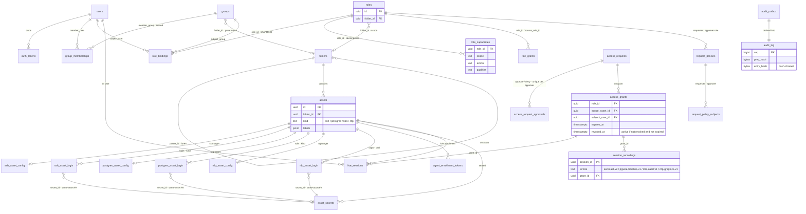

# Data model

A reference for warden's Postgres schema: the tables, their key columns, and how they
relate. This is the storage behind the concepts in
[access-model.md](access-model.md); read that first for the meaning, this for the
columns. The schema is defined by the goose migrations embedded in the binary
(`warden/internal/postgres/migrate/migrations`): `0001_schema.sql` is the core
schema, `0002_postgres_asset.sql` adds the Postgres asset tables,
`0003_agent_enrollment.sql` adds Kubernetes agent enrollment,
`0004_authz_mgmt_visibility_fns.sql` adds the management-visibility SQL functions,
and `0005_rdp_asset.sql` adds the RDP asset tables.

The relationship rows are tuple-shaped (subject → relation → object), so the whole
model could be mirrored into an external relationship engine (OpenFGA) without
changing the domain — see [decisions.md](decisions.md).

## ER diagram



## Identity

### `users` — local accounts

| Column | Notes |
|---|---|
| `id` | uuid PK |
| `email` | unique |
| `display_name` | |
| `password_hash` | argon2id (default `''`) |
| `deactivated_at` | timestamptz, nullable; NULL means active. Non-NULL is rejected at Login, at the auth interceptor, and filtered out of every authz closure. See [security.md](security.md#account-deactivation). |

### `groups` — named subject sets

A group can be homed in a folder for delegated administration (governance only;
`folder_id` does not affect membership or where the group is bound). Names are
`^[a-z0-9_-]+$` and unique per home (partial unique indexes: one namespace for
global/root groups, one per folder).

| Column | Notes |
|---|---|
| `id` | uuid PK |
| `name` | `^[a-z0-9_-]+$` |
| `folder_id` | → `folders(id)` (`ON DELETE CASCADE`), nullable (NULL means global/root) |

### `group_memberships` — nested membership edges

A member is either a user or a group (XOR, `one_member`), which is what makes groups
nested. `no_self_member` blocks direct self-membership; unique indexes prevent
duplicate edges.

| Column | Notes |
|---|---|
| `id` | uuid PK |
| `group_id` | the containing group → `groups(id)` |
| `member_user_id` | member is a user → `users(id)` (nullable) |
| `member_group_id` | member is a group → `groups(id)` (nullable) |

## Catalog

### `folders` — resource tree

Self-referential via `parent_id` (a forest). `no_self_parent` blocks direct `A→A`;
the recursive CTEs assume this forest shape. Names are `^[a-z0-9_-]+$`.

| Column | Notes |
|---|---|
| `id` | uuid PK |
| `name` | `^[a-z0-9_-]+$` |
| `parent_id` | → `folders(id)` (`ON DELETE CASCADE`), nullable (root folders) |

### `assets` — protected resources

| Column | Notes |
|---|---|
| `id` | uuid PK |
| `folder_id` | → `folders(id)`, NOT NULL (`ON DELETE CASCADE`) — every asset lives in exactly one folder |
| `name` | `^[a-z0-9_-]+$` |
| `kind` | text, NOT NULL DEFAULT `'ssh'`, CHECK in (`ssh`, `postgres`, `k8s`, `rdp`). Selects the asset's typed credential config; `assets` stays the generic authz anchor (roles, bindings, grants, and policies reference `assets.id` protocol-agnostically). An `ssh` asset has `ssh_asset_config` plus `ssh_asset_login`; a `postgres` asset has `postgres_asset_config` plus `postgres_asset_login`; an `rdp` asset has `rdp_asset_config` plus `rdp_asset_login`; a `k8s` asset has no connection config (the agent enrolls). |
| `labels` | jsonb (default `{}`), GIN-indexed |

### `catalog_names` — sibling-uniqueness registry

One row per folder and per asset, giving folders and assets a shared sibling namespace
so no two siblings collide regardless of kind. Uniqueness is enforced race-free by
partial unique indexes over `(parent_id, name)` (and over `name` for roots), written
inside the create transaction, with no triggers. A canonical dotted path (for example
`pg-primary.db.prod`) is computed on read by walking the ancestry.

| Column | Notes |
|---|---|
| `parent_id` | → `folders(id)` (`ON DELETE CASCADE`), nullable (NULL means a root sibling) |
| `name` | `^[a-z0-9_-]+$` |
| `folder_id` | → `folders(id)` (`ON DELETE CASCADE`), nullable — set if this row names a folder |
| `asset_id` | → `assets(id)` (`ON DELETE CASCADE`), nullable — set if this row names an asset |

`one_kind` CHECK: exactly one of `folder_id` / `asset_id`.

### `ssh_asset_config` — SSH connection config

1:1 with an `ssh` asset (`asset_id` is the PK). Holds how to reach the host; the
per-login auth lives in `ssh_asset_login`.

| Column | Notes |
|---|---|
| `asset_id` | uuid PK → `assets(id)` (`ON DELETE CASCADE`) |
| `target_address` | text NOT NULL (default `''`) — the host:port the worker dials |
| `host_public_key` | text NOT NULL (default `''`) — the target's SSH host key (plumbed for host-key pinning; not yet enforced) |

### `ssh_asset_login` — per-login auth facts

Per-asset, per-login authentication. Each login names an auth `kind`; for the
stored-secret kinds it links a secret of the same asset. The broker enforces
`ssh:login:<login>` before issuing any credential, for every kind.

| Column | Notes |
|---|---|
| `asset_id` | → `assets(id)` (`ON DELETE CASCADE`); part of PK |
| `login` | text; part of PK `(asset_id, login)` |
| `kind` | text, CHECK in (`ca`, `password`, `key`) |
| `secret_id` | → `asset_secrets` by a composite FK `(asset_id, id)` (`ON DELETE RESTRICT`), nullable. Required unless `kind='ca'` (`ssh_login_secret_present`); the composite FK guarantees the secret belongs to the same asset |

### `postgres_asset_config` — Postgres connection config

1:1 with a `postgres` asset (`asset_id` is the PK). Added in `0002_postgres_asset.sql`.
Holds how to reach the database; the per-role auth lives in `postgres_asset_login`.

| Column | Notes |
|---|---|
| `asset_id` | uuid PK → `assets(id)` (`ON DELETE CASCADE`) |
| `target_address` | text NOT NULL (default `''`) — the host:port the worker dials |
| `target_server_ca` | text NOT NULL (default `''`) — PEM of the target server's CA for verify-full TLS; empty means encryption without a pin |
| `default_database` | text NOT NULL (default `''`) — the DB used when the client omits one |

### `postgres_asset_login` — per-role auth facts

Per-asset, per-DB-role authentication. Each login names an auth `kind`; the
`password` kind links a secret of the same asset, and `mtls` mints a client
certificate with no stored secret. The broker enforces `db:login:<role>` before
issuing any credential.

| Column | Notes |
|---|---|
| `asset_id` | → `assets(id)` (`ON DELETE CASCADE`); part of PK `(asset_id, role)` |
| `role` | text — the Postgres role name; part of PK |
| `kind` | text, CHECK in (`mtls`, `password`) |
| `secret_id` | → `asset_secrets` by a composite FK `(asset_id, id)` (`ON DELETE RESTRICT`), nullable. Required unless `kind='mtls'` (`postgres_login_secret_present`); the composite FK guarantees the secret belongs to the same asset |

### `rdp_asset_config` — RDP connection config

1:1 with an `rdp` asset (`asset_id` is the PK). Added in `0005_rdp_asset.sql`. Holds
how to reach the target; the per-login auth lives in `rdp_asset_login`.

| Column | Notes |
|---|---|
| `asset_id` | uuid PK → `assets(id)` (`ON DELETE CASCADE`) |
| `target_address` | text NOT NULL (default `''`) — the host:port the rdp-proxy worker dials |
| `target_server_ca` | text NOT NULL (default `''`) — PEM of the target's TLS CA/cert; set verifies the target, empty requires TLS without a pin |

### `rdp_asset_login` — per-login auth facts

Per-asset, per-login authentication for an RDP asset. `kind` is CHECK-constrained to
`password` only (no `ca`/`mtls` arm yet), so `secret_id` is unconditionally required.
The broker enforces `rdp:login:<login>` before issuing any credential.

| Column | Notes |
|---|---|
| `asset_id` | → `assets(id)` (`ON DELETE CASCADE`); part of PK `(asset_id, login)` |
| `login` | text; part of PK |
| `kind` | text, CHECK in (`password`) |
| `secret_id` | → `asset_secrets` by a composite FK `(asset_id, id)` (`ON DELETE RESTRICT`), NOT NULL (`rdp_login_secret_present`); the composite FK guarantees the secret belongs to the same asset |

### `asset_secrets` — per-asset stored secrets

Named sealed secrets bound to an asset (for example a stored password or private key).
`UNIQUE (asset_id, name)`; also `UNIQUE (asset_id, id)` to back the composite FKs from
`ssh_asset_login`, `postgres_asset_login`, and `rdp_asset_login`. Values leave warden
only via the broker; `List` returns id, name, and created_at metadata only.

| Column | Notes |
|---|---|
| `id` | uuid PK |
| `asset_id` | → `assets(id)` (`ON DELETE CASCADE`) |
| `name` | text NOT NULL |
| `sealed` | bytea NOT NULL — `Seal`ed value; never returned via the API |

## Authorization

### `roles` — capability bundles

A role is global or homed in a folder (`folder_id`), which both scopes its management
and makes it DNS-addressable as `<role>.<folder-path>`. The role's capabilities live in
`role_capabilities`, not on this row. Names are `^[a-z0-9_-]+$`, unique per home.

| Column | Notes |
|---|---|
| `id` | uuid PK |
| `name` | `^[a-z0-9_-]+$` |
| `folder_id` | → `folders(id)` (`ON DELETE CASCADE`), nullable (NULL means global) |

### `role_capabilities` — decomposed capability patterns

Each capability pattern on a role is stored as one row, decomposed into its segments:
`ssh:login:root` becomes `(ssh, login, root)`, `db:read` becomes `(db, read, '')`, and
`k8s:group:system:masters` becomes `(k8s, group, system:masters)`. The PK is
`(role_id, scope, action, qualifier)`, and a btree index on `(scope, action, qualifier)`
makes matching a keyed lookup. See [capabilities.md](capabilities.md#storage).

| Column | Notes |
|---|---|
| `role_id` | → `roles(id)` (`ON DELETE CASCADE`) |
| `scope` | text — the first segment (`ssh`, `db`, `k8s`, `catalog`, `**`) |
| `action` | text — the second segment (empty for a bare `**`) |
| `qualifier` | text — the remaining segments joined by `:` (empty when absent) |

### `role_bindings` — role → subject @ scope (standing-only)

Attaches a role to a subject at a scope. Standing-only: permanent, admin-granted
access (requestability comes from `request_policies`, not a binding). Scope is a
folder, an asset, or neither (a scopeless global binding that confers the role
everywhere): `at_most_one_scope` CHECK allows both scope columns NULL. Subject is user
xor group (`one_subject`).

| Column | Notes |
|---|---|
| `id` | uuid PK |
| `role_id` | → `roles(id)` (`ON DELETE CASCADE`) |
| `scope_folder_id` | scope is a folder → `folders(id)` (`ON DELETE CASCADE`, nullable) |
| `scope_asset_id` | scope is an asset → `assets(id)` (`ON DELETE CASCADE`, nullable) — deleting the asset drops its asset-scoped bindings |
| `subject_user_id` | subject is a user → `users(id)` (nullable) |
| `subject_group_id` | subject is a group → `groups(id)` (nullable) |

### `role_grants` — the ReBAC rewrite rules

"holding source_role_id on the relevant object CONFERS role_id", resolved by
`HoldsRole`. `(role_id, source_role_id, via)` is unique; `no_self_same_object` blocks a
trivial `R ⊇ R via same_object`.

| Column | Notes |
|---|---|
| `id` | uuid PK |
| `role_id` | the conferred role `R` → `roles(id)` |
| `source_role_id` | the source role `S` → `roles(id)` |
| `via` | CHECK in (`same_object`, `parent`) — role composition vs folder cascade |

### `request_policies` — requestability plus approval per (role, scope)

One row per (role, scope) makes that role requestable on that scope: its existence is
the requestability, and it carries both the requester side and the approval side.
Scope is NULL (the role-level default) or exactly one of folder/asset (an override) —
`scope_shape` CHECK; partial-unique indexes enforce one default and one override per
(role, scope). An optional `name` (unique per scope) makes a policy addressable as
`<name>@<asset-path>`.

| Column | Notes |
|---|---|
| `id` | uuid PK |
| `role_id` | the requestable role → `roles(id)` (`ON DELETE CASCADE`) |
| `scope_folder_id` | override scope folder → `folders(id)` (`ON DELETE CASCADE`, nullable) |
| `scope_asset_id` | override scope asset → `assets(id)` (`ON DELETE CASCADE`, nullable) — deleting the asset drops its asset-scoped policies; both NULL means role-level default |
| `name` | text, nullable, `^[a-z0-9_-]+$`; unique per scope |
| `required_approvals` | int, CHECK ≥ 0 (the N-of-M threshold). `0` is self-service: an eligible requester is auto-granted, no approver needed |
| `approver_role_id` | "holders of this role on the scope may approve" → `roles(id)` (nullable, `ON DELETE RESTRICT`) |
| `requester_role_id` | "holders of this role on the scope may request" → `roles(id)` (nullable, `ON DELETE RESTRICT`). A NULL requester-role is not "anyone" |
| `max_duration` | interval, nullable — per-policy ceiling on a granted duration; NULL falls back to the global `MaxGrantTTL` cap |

### `request_policy_subjects` — explicit requester/approver subjects

The explicit-subject half of both the requester and approver sets, distinguished by
`kind`. Subject is user xor group (`one_subject`).

| Column | Notes |
|---|---|
| `id` | uuid PK |
| `policy_id` | → `request_policies(id)` (`ON DELETE CASCADE`) |
| `kind` | CHECK in (`requester`, `approver`) — which side this subject is on |
| `subject_user_id` | → `users(id)` (nullable) |
| `subject_group_id` | → `groups(id)` (nullable) |

## Just-in-time access

### `access_requests` — JIT access requests

A user's request to activate a requestable role on an asset. `required_approvals` and
`granted_duration` are snapshots taken at request time (from the effective policy and
the clamped duration) so a mid-flight policy edit cannot change an in-progress
request. A partial-unique index (`uq_pending_request` on
`(requester_user_id, role_id, asset_id) WHERE status='pending'`) blocks a second
pending request for the same tuple.

| Column | Notes |
|---|---|
| `id` | uuid PK |
| `requester_user_id` | → `users(id)` (`ON DELETE CASCADE`) |
| `role_id` | requested role → `roles(id)` (`ON DELETE CASCADE`) |
| `asset_id` | requested scope asset → `assets(id)` (`ON DELETE CASCADE`) |
| `reason` | text (default `''`) — free-form justification |
| `requested_duration` | interval — what the requester asked for |
| `required_approvals` | int — snapshot of the effective policy's N-of-M threshold |
| `granted_duration` | interval — snapshot of the clamped grant lifetime |
| `status` | CHECK in (`pending`, `granted`, `denied`, `cancelled`); default `pending` |
| `created_at` / `resolved_at` | timestamptz; `resolved_at` set when it leaves `pending` |

### `access_request_approvals` — per-approver decisions

`UNIQUE (request_id, approver_user_id)` enforces one decision per approver. A single
`deny` rejects the request; the N-th distinct `approve` mints the grant.

| Column | Notes |
|---|---|
| `id` | uuid PK |
| `request_id` | → `access_requests(id)` (`ON DELETE CASCADE`) |
| `approver_user_id` | → `users(id)` (`ON DELETE CASCADE`) |
| `decision` | CHECK in (`approve`, `deny`) |

### `access_grants` — time-boxed JIT grants

Written when a request is granted (self-service at `required_approvals=0`, or on
reaching the threshold). Always to a user at an asset scope, with denormalized
`role_id` / `scope_asset_id` so the grant joins the authorizer directly.
`UNIQUE (request_id)` — a request yields at most one grant. A grant is active when
`revoked_at IS NULL AND expires_at > now()`; the authorizer's held-closure base is
`role_bindings ∪ active access_grants`, so a live grant flows through the role-rewrite
graph exactly like a standing binding and stops the instant it expires or is revoked.

| Column | Notes |
|---|---|
| `id` | uuid PK |
| `request_id` | → `access_requests(id)` (`ON DELETE CASCADE`); UNIQUE |
| `role_id` | granted role → `roles(id)` (`ON DELETE CASCADE`) |
| `scope_asset_id` | granted scope asset → `assets(id)` (`ON DELETE CASCADE`) |
| `subject_user_id` | grantee → `users(id)` (`ON DELETE CASCADE`) |
| `granted_at` / `expires_at` | timestamptz; `expires_at` NOT NULL — end of the window |
| `revoked_at` | timestamptz, nullable — set on manual revoke, deactivation, or expiry |
| `revoked_by` | → `users(id)` (`ON DELETE SET NULL`); NULL actor means reaper/system |
| `revoked_reason` | text, nullable (`expired`, `user_deactivated`, or a caller reason) |

## Vault

All `sealed bytea` columns hold envelope-encrypted material (a per-secret AES-256-GCM
DEK wrapped by the master KEK — see [security.md](security.md#secrets-at-rest));
plaintext never touches the DB, and sealed bytes are never returned via the API.
(`asset_secrets` is documented under [Catalog](#asset_secrets--per-asset-stored-secrets).)

### `ca_keys` — certificate-authority key material

Sealed CA singletons, at most one active per kind (partial unique index on
`(kind) WHERE active`). Created via `VaultService`.

| Column | Notes |
|---|---|
| `id` | uuid PK |
| `kind` | text, CHECK in (`ssh`, `x509`, `mesh`) — SSH user CA (ed25519), X.509 client CA (ECDSA P-256), or the mesh CA (ECDSA P-256) |
| `sealed` | bytea NOT NULL — sealed CA private material; never returned via the API |
| `public_material` | text NOT NULL — the distributable public half (SSH: the `authorized_keys` CA line; X.509/mesh: the CA cert PEM). Returned by `GetCAPublic` |
| `active` | boolean NOT NULL DEFAULT true — one active per kind |

### `session_signing_keys` — data-plane token signing key

The Ed25519 key that signs PASETO session admission tokens; sealed at rest, at most
one active (partial unique index). Initialized via `VaultService.InitSessionKey`.

| Column | Notes |
|---|---|
| `id` | uuid PK |
| `sealed` | bytea NOT NULL — sealed private key |
| `public_key` | bytea NOT NULL — the verification key (served to the gateway) |
| `active` | boolean NOT NULL DEFAULT true |

### `agent_enrollment_tokens` — Kubernetes agent enrollment

Single-use tokens that let an in-cluster Kubernetes agent obtain a mesh certificate.
Added in `0003_agent_enrollment.sql`. Only the token's SHA-256 hash is stored; the
token itself is the credential and is shown once. `SignAgentCert` consumes a row with
an atomic `DELETE … RETURNING`. See
[architecture.md](architecture.md#agent-enrollment).

| Column | Notes |
|---|---|
| `id` | uuid PK |
| `asset_id` | → `assets(id)` (`ON DELETE CASCADE`) — the cluster asset the agent enrolls for |
| `token_hash` | bytea, unique — SHA-256 of the issued token |
| `expires_at` | timestamptz — 30-minute TTL from mint |
| `created_at` | timestamptz |

## Data plane

### `live_sessions` — the durable session ledger

One row per admitted live session, keyed to the authorization it relies on so
continuous-revocation re-evaluation can find and tear down affected sessions.

| Column | Notes |
|---|---|
| `id` | uuid PK — the session id (also in the admission token) |
| `user_id` | → `users(id)` (`ON DELETE CASCADE`) |
| `asset_id` | → `assets(id)` (`ON DELETE CASCADE`) |
| `worker_id` | text — the owning worker (from its mesh-cert SPIFFE SAN) |
| `grant_id` | → `access_grants(id)` (`ON DELETE SET NULL`), nullable — the grant the session relies on, if any |
| `protocol` | text |
| `principals` | `text[]` — the cert principals the session was set up with |
| `client_key_fp` | text — the client's ephemeral key fingerprint (`cnf`), for SSH |
| `started_at` | timestamptz |
| `terminate_requested_at` | timestamptz, nullable — set when teardown is requested (idempotent) |

### `session_recordings` — recording artifacts

One row per recorded session, with storage location and integrity metadata. `format`
distinguishes the per-protocol schema; `grant_id` attributes the recording for
oversight.

| Column | Notes |
|---|---|
| `session_id` | uuid PK |
| `user_id` / `asset_id` / `worker_id` | who and where |
| `protocol` / `format` | for example `ssh` / `asciicast-v2`, `postgres` / `pgwire-timeline-v1`, `k8s` / `k8s-audit-v1`, `rdp` / `rdp-graphics-v1` |
| `object_key` | text — the object-store key (protocol-partitioned, for example `recordings/ssh/<date>/<session_id>.cast`) |
| `size_bytes` / `sha256` | the uploaded size and rolling hash |
| `status` | text — for example in-progress, completed, failed |
| `grant_id` | → `access_grants(id)`, nullable — the grant the session relied on |
| `started_at` / `ended_at` / `created_at` | timestamptz |

### `worker_presence` — heartbeat table

Tracks connected data-plane workers so the sweeper can partition ownership and the
orphan GC can detect unreachable workers.

| Column | Notes |
|---|---|
| `worker_id` | text PK |
| `last_seen_at` | timestamptz — updated on each heartbeat |

## Audit

### `audit_log` — hash-chained append-only log

Tamper-evident: `entry_hash = sha256(prev_hash ‖ canonical(entry))`. `seq` is a
generated identity (monotonic order); both `seq` and `entry_hash` are unique. See
[architecture.md](architecture.md#audit--recording).

| Column | Notes |
|---|---|
| `id` | uuid PK |
| `seq` | bigint, GENERATED ALWAYS AS IDENTITY (chain order), unique |
| `event_type` | |
| `actor_user_id` | uuid, nullable (no FK — actors may be deleted) |
| `subject` | text (default `''`) |
| `details` | jsonb (default `{}`) |
| `prev_hash` | bytea — previous entry's `entry_hash` |
| `entry_hash` | bytea, unique — this entry's hash |

### `audit_outbox` — transactional event queue

State-changing services enqueue an event here inside their domain transaction; a
background drainer chains it into `audit_log` and deletes the row (exactly-once,
crash-safe). See [security.md](security.md#tamper-evident-audit).

| Column | Notes |
|---|---|
| `id` | uuid PK |
| `seq` | bigint, GENERATED ALWAYS AS IDENTITY |
| `event_type` / `actor_user_id` / `subject` / `details` | the pending event, same shape as `audit_log` |

## Auth

### `auth_tokens` — opaque bearer tokens

Login mints a random token; only its hash is stored. Instant server-side revocation is
a row delete. See [security.md](security.md#authn--token-model).

| Column | Notes |
|---|---|
| `id` | uuid PK |
| `user_id` | → `users(id)` (`ON DELETE CASCADE`) |
| `token_hash` | bytea, unique |
| `expires_at` | timestamptz |

## Authorization SQL functions & the active-grants view

The authorization semantics are part of the schema, not just the Go code. The
migrations define a set of SQL functions and one view that are the single source of
the recursive-closure logic. They are `LANGUAGE sql STABLE`, so PostgreSQL inlines
them into the callers, and warden reaches them through static, typed sqlc queries in
`warden/internal/postgres/queries/authz.sql`.

### `active_access_grants` — the "grant is live" view

```sql
CREATE VIEW active_access_grants AS
    SELECT * FROM access_grants WHERE revoked_at IS NULL AND expires_at > now();
```

The single definition of an active grant, shared by every function's grant arm so the
`revoked_at IS NULL AND expires_at > now()` predicate is never hand-copied.

### The `authz_*` functions

| Function | Returns | Role |
|---|---|---|
| `authz_user_is_active(user)` | `boolean` | the deactivation guard — a deactivated user's closures return nothing |
| `authz_user_groups(user)` | `group_id` set | the transitive, cycle-safe nested-group membership closure |
| `authz_held_impl(user, include_grants)` | `(role_id, object_kind, object_id)` | the one forward held-closure body; the `include_grants` flag gates the JIT-grant base arm |
| `authz_held(user)` | `(role_id, object_kind, object_id)` | held closure including active grants — the everyday visibility and `Check` source |
| `authz_held_standing(user)` | `(role_id, object_kind, object_id)` | held closure excluding grants — the requester/approver standing-only predicate |
| `authz_global_held(user)` | `role_id` set | roles held globally via a scopeless binding, closed over `role_grants` (no grant arm; JIT grants are always asset-scoped) |
| `authz_role_goals(role, object_kind, object_id)` | `(role_id, object_kind, object_id)` | backward goal expansion (not user-scoped) backing `HoldsRole`/`HoldsRoleStanding` |
| `authz_effective_request_policy(role, asset)` | ≤1 policy row | most-specific request policy: asset override > nearest ancestor folder > role-level default |
| `authz_role_goal_paths(user, role, asset)` | `(path, binding_id, …)` | the `ExplainRole` derivation enumerator |
| `authz_mgmt_read_anchor_folders`, `authz_mgmt_visible_folders`, `authz_mgmt_global_read` | folder sets / boolean | management-visibility helpers (added in `0004`) that back the visibility-filtered browse endpoints |

The held and goal functions traverse `role_grants` through both rewrite arms
(`same_object` role composition and `parent` folder→child cascade over `folders` and
`assets`), so the folder-cascade and role-rewrite semantics described in
[access-model.md](access-model.md) live entirely inside these functions. Capability
matching runs as a three-column predicate over `role_capabilities`, proven equivalent
to the Go `CapMatch` glob by `TestSQLCapMatchMatchesGo`. A build-time grep-guard
(`internal/authz/no_raw_closure_sql_test.go`) forbids re-introducing a `WITH RECURSIVE`
closure or a hand-rolled `user_groups`/`held_standing`/`global_held` CTE in Go, keeping
the DB functions the sole source.

## Asset-scoped cascade cleanup

Deleting an asset must not strand governance rows that reference it. Rather than
imperative cleanup, the schema leans on `ON DELETE CASCADE` foreign keys so a single
`DELETE FROM assets` removes everything asset-scoped in one step:

| Referencing column | On asset delete |
|---|---|
| `role_bindings.scope_asset_id` | asset-scoped standing bindings dropped |
| `request_policies.scope_asset_id` | asset-scoped request policies dropped (their subjects cascade in turn) |
| `access_grants.scope_asset_id` | grants against the asset dropped |
| `access_requests.asset_id` | requests against the asset dropped |
| `ssh_asset_config`, `ssh_asset_login`, `postgres_asset_config`, `postgres_asset_login`, `rdp_asset_config`, `rdp_asset_login` | SSH, Postgres, and RDP config, logins dropped |
| `asset_secrets.asset_id`, `catalog_names.asset_id`, `agent_enrollment_tokens.asset_id` | secrets, the name-registry row, and enrollment tokens dropped |

`DeleteAsset` first tears down the asset's live sessions (an out-of-band side effect
the database cannot express), then issues the delete and lets these FKs do the rest;
`live_sessions.asset_id` is itself `ON DELETE CASCADE`. This is why the domain code
carries no per-table asset-cleanup queries.

## Related

- [access-model.md](access-model.md) — the conceptual model these tables encode.
- [capabilities.md](capabilities.md) — the format and storage of role capabilities.
- [security.md](security.md) — the security posture, including audit and tokens.
